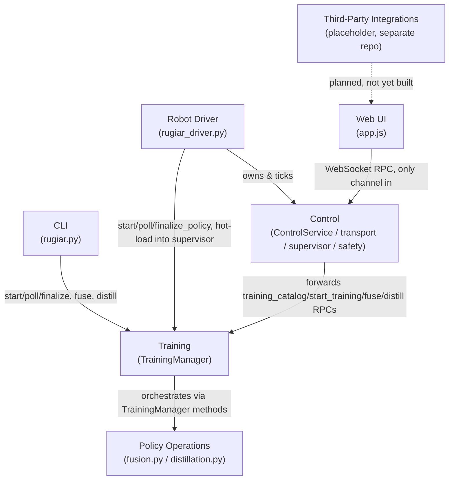

# RUgiar Architecture

## Overview

RobotUniversityGiar (RUgiar) is a Genesis/Isaac-Gym-based fork of `unitree_rl_gym` that covers the full lifecycle of a Unitree humanoid/quadruped policy: training it, transforming it after the fact (fusing or distilling), and then driving a real or simulated robot with it under live operator supervision. The codebase splits along that lifecycle into seven areas. Training produces `policies/<name>/` folders on disk; Policy Operations reads and rewrites those same folders without training; the Robot Driver process (`rugiar_driver.py`) loads policies into a live sim/real loop and exposes a WebSocket control protocol that Control implements and the Web UI (and any other client) speaks; the CLI (`rugiar`) is a thin, side-effect-free frontend onto Training and Policy Operations only, deliberately never touching the live-robot layer. Third-Party Integrations is a placeholder for a motion-capture retargeting pipeline being built in a separate repo. The seven areas are designed to be worked on in parallel — this document exists to make the boundaries between them explicit before that happens.

## The Seven Areas

1. **Training** — launches and tracks PPO training/fine-tuning jobs (local subprocess or Kaggle), owns the policy catalog.
2. **Policy Operations (fuse/distill)** — post-training weight merging and behavior cloning; parallel to Training, not part of it.
3. **Control** — the live-robot engine: policy switching, safety, WebSocket transport, adapters.
4. **Web UI** — the browser client for Control, plus the Training/Fuse/Distill forms.
5. **CLI** — `rugiar` command-line entry point onto Training and Policy Operations only.
6. **Robot Driver** — the process (`rugiar_driver.py` / `rugiar_driver_target.py`) that wires Control, an adapter, and a simulator or real robot together and runs the main loop.
7. **Third-Party Integrations** — placeholder. A collaborator is building human motion-capture retargeting in a separate repo; the plan is for it to eventually feed into RUgiar, most likely as a new panel/data source in the Web UI (e.g. driving a policy or providing reference motion). No integration surface exists yet — treat any code path here as unclaimed until that work lands.

---

## Area Details

### 1. Training

**Owns:** `legged_gym/control/training.py` (`TrainingManager`, ~1520 lines) — job lifecycle (local subprocess or Kaggle thread), the in-memory `policy_sources` catalog, training-time telemetry/history, system sizing (`system_info`, `estimate`).

**Entry points:**
- `TrainingManager.start(...)` → job_id — launches `web_train.py` (local) or a `KaggleRunner` thread (kaggle).
- `TrainingManager.poll()` — once per sim tick, non-blocking; returns newly finished jobs.
- `TrainingManager.finalize_policy(...)` — copies checkpoint + train_checkpoint.pt + meta.json + train.log into `policies/<name>/`, registers it.
- Catalog/introspection: `discover_local_policies`, `catalog`, `task_defaults`, `policy_info`, `get_policy_order` / `set_policy_order`.
- `start_distillation(...)` and `fuse_policies(...)` also live on `TrainingManager` (see Policy Operations below) — they share job/finalization plumbing with training.

**Talks to:**
- **Robot Driver** (`rugiar_driver.py`) is `TrainingManager`'s primary caller: it calls `start()`, `poll()`, `finalize_policy()` and, on completion, hot-loads the result into the live `PolicySupervisor` — but `training.py` never imports or touches `PolicySupervisor`/`ControlService` itself. That boundary is intentional and load-bearing.
- **Web UI** calls nearly every `TrainingManager` method directly through Control's WebSocket RPC (`training_catalog`, `start_training`, `estimate_training_time`, etc.) — see Control §3.
- **CLI** calls `start()`, `start_distillation()`, `fuse_policies()`, `get_policy_order()`/`set_policy_order()` as pure pass-through, blocking on `poll()` itself instead of a driver loop.
- Spawns `legged_gym/scripts/web_train.py` and `legged_gym/scripts/web_distill.py` as subprocesses; delegates to `legged_gym/control/kaggle_backend.py::KaggleRunner` for the Kaggle backend, `legged_gym/control/fusion.py` and `legged_gym/control/distillation.py` for the actual algorithms.
- Reads/writes `policies/<name>/`, `.policy_order.json`, `logs/_web_training/history.json`.

**Known risk:** `training.py` mixes six concerns in one 1520-line file (job lifecycle, policy catalog, log parsing, system profiling, fusion/distillation orchestration, Kaggle integration) — the single highest merge-conflict-risk file in the repo. See Collaboration Boundaries below.

---

### 2. Policy Operations (fuse/distill)

**Owns:** `legged_gym/control/fusion.py` (weight merging: `merge_state_dicts`, `rebasin_align`, `infer_architecture`) and `legged_gym/control/distillation.py` (behavior cloning: `collect_rollout`, `bc_train`, `check_dimensions_compatible`). Orchestration for both lives in `training.py` (`fuse_policies()` and `start_distillation()`), not here — the algorithms are separated from the job/lifecycle plumbing that drives them.

**Entry points:**
- CLI: `rugiar fuse --policies ... --name ... [--method weighted_average|git_rebasin]`, `rugiar distill --teacher ... --task ... --name ...`.
- RPC (via Control): `ControlService.fuse_policies(...)`, `ControlService.start_distillation(...)`.
- Web UI: "Fuse policies…" and "Distill policy…" panels.

**Two operations, two execution models:**
| | Fusion | Distillation |
|---|---|---|
| Execution | Synchronous, in-process tensor op | Asynchronous subprocess (`web_distill.py`) |
| Requires | `train_checkpoint.pt` on every source (raw rsl_rl state) | Only `checkpoint.pt` on the teacher (any of 5 loadable formats) |
| Hard check | Identical architecture across sources | Matching obs/action dimensions only |
| Duration | Seconds | Minutes, polled like a training job |

**Talks to:**
- **Training** — both operations are literally methods on `TrainingManager` and write to `policies/<name>/` + `register_source()` the same way a training job does; distillation shares `poll()`/`finalize_policy()`.
- **CLI** and **Web UI** call these the same way they call training (see §5, §4).
- Does **not** talk to Control, Robot Driver, or the live sim in any way — outputs are just files a driver may later load.

**Known risk:** `stable` and other externally-sourced policies lack `train_checkpoint.pt` and so can never be fused (only distilled) — this is a hard architectural limitation, not a bug, but is a common newcomer confusion.

---

### 3. Control

**Owns:** the live-robot engine, split into cooperating single-purpose classes:

| Class | File | Responsibility |
|---|---|---|
| `ControlService` | `service.py` | Single public API surface; state flags (paused, restart_requested); glues adapter + supervisor + safety + selector + training together |
| `ControlServer` | `transport.py` | WebSocket `/ws` (FastAPI/uvicorn), thread-safe command queue, status/camera broadcast, MJPEG stream |
| `PolicySupervisor` | `supervisor.py` | Loaded policies, active/pending switch, 15-tick ramp/blend on switch |
| `SafetyGovernor` | `safety.py` | Fall/NaN detection, forces a damping fallback, gates pending switches |
| `Selector` (Protocol) | `selector.py` | Autonomous policy proposal; goes through the same safety gate as a human request |
| `SimAdapter` / `RealAdapter` | `adapter.py` / `deploy/real_adapter.py` | Robot lifecycle (reset, step, manual command, speed limit); `RealAdapter` lives in a separate package so `legged_gym/control/` stays installable without `unitree_sdk2` |
| `Policy` + backends | `policy.py` | Network module + obs_spec; 5 auto-detected checkpoint formats |

**Entry points:** `ControlService` methods, reachable only through `ControlServer`'s WebSocket RPC (30 methods — `request_switch`, `set_command`, `pause`/`resume`/`estop`, `restart`, plus every Training/Policy-Ops method listed above, reflected through here for the Web UI). One exception: `request_switch`, `pause`, `resume`, `estop` may be called directly off the sim thread (cheap flag-sets only, no I/O) — see the concurrency note below before adding anything else to that path.

**Talks to:**
- **Training / Policy Operations** — `ControlService` holds a `TrainingManager` instance and forwards nearly every RPC method to it 1:1; it never reaches into `training.py` internals.
- **Web UI** — the only *built-in* consumer of the WebSocket protocol; all 30 RPC methods exist because the Web UI calls them. Any external client can speak the same protocol — `examples/joystick_controller.py` is a working reference implementation (gamepad or `--demo`) worth checking when changing anything in `transport.py`'s wire format, since it's the cheapest way to sanity-check a protocol change end to end without the Web UI.
- **Robot Driver** — instantiates and owns `ControlService`, `ControlServer`, the adapter, `PolicySupervisor`, `SafetyGovernor`; ticks them once per frame and drains finished training jobs into the supervisor.
- **CLI** — no path at all (see §5's confirmed-boundary section).

**Concurrency model:** two threads — the sim thread (owned by Robot Driver's main loop) and the socket thread (uvicorn's asyncio loop). Commands flow async→sync through a `Queue`, drained once per tick by `drain_commands()`; status/camera flow sync→async through locked snapshots written every tick and read every ~100/80ms. All `ControlService` calls other than the four cheap flag-setters above **must** go through this queue — this is the single most important invariant for anyone touching Control.

---

### 4. Web UI

**Owns:** `web/index.html` (markup, ~1220 lines) and `web/app.js` (all logic, ~3640 lines) — currently one monolithic file with no module boundaries, ~50 module-scope globals, and no build step (by design, as course material).

**Entry points:** none from other areas — this is a leaf. It is driven entirely by `ControlServer`'s WebSocket protocol: `send()` (fire-and-forget) and `call()` (promise-based, matched by message id) wrap every outbound RPC; a `status` broadcast (~10Hz) drives `applyStatus()`, the central render function most panels hook into.

**Panels:** Keyboard, Pause/Restart, Live Telemetry, Camera (stub, hidden unless `--camera`), Command HUDs (WASD + drag + mouse-look, all sharing `cruiseVx/Vy/Yaw` state), Family switch, Policies (list/reorder/rename/delete, shortcut keys), Stress Stimuli, Training (Train/Fuse/Distill forms, ~150 combined DOM refs). A separate "Policy Info Dock" (always visible, not a drawer) shows training curves, provenance, and the training command for the currently-viewed policy.

**Talks to:**
- **Control** exclusively, via the WebSocket protocol described in §3 — this is the *only* channel; there is no other path into the system.
- **Third-Party Integrations** will most likely land here first (see §7) — no code exists yet.

**Known risk:** genuinely the highest same-area collision risk in the repo — everything lives in one global scope with no panel registry, no centralized state object, and no render-function-per-panel convention. Two people adding panels concurrently will very likely collide on global names or on the shared `applyStatus()` render pass. See Collaboration Boundaries.

---

### 5. CLI

**Owns:** `legged_gym/cli/rugiar.py` (~617 lines) — argument parsing and pure forwarding for four subcommands: `train`, `order`, `fuse`, `distill`, plus read-only discovery flags (`--list_tasks`, `--list_policies`, `--list_reward_scales`, `--list_fusion_methods`, `--list_distill_methods`).

**Entry points:** the `rugiar` executable itself. Every subcommand does argv→kwargs mapping into one `TrainingManager` call, then (for `train`/`distill`) blocks on `poll()` in-process, printing live log/progress, and calls `finalize_policy()` on success itself — the CLI is its own driver loop for job completion, separate from `rugiar_driver.py`'s.

**Talks to:**
- **Training / Policy Operations** only — `TrainingManager.start()`, `.start_distillation()`, `.fuse_policies()`, `.get_policy_order()`/`.set_policy_order()`. Zero logic duplicated; every call forwards its full kwargs.
- **Confirmed zero contact with Control or Robot Driver.** No import of `SimAdapter`, `PolicySupervisor`, `SafetyGovernor`, `ControlService`, or `RealAdapter` anywhere in `rugiar.py`. The one `legged_gym.envs` import exists solely to populate `task_registry` as an import side effect (needed even for `--list_tasks`), not to build any simulator or environment.

This is the cleanest boundary in the repo and worth preserving deliberately: if a future change makes the CLI reach into Control or the driver, that is a boundary violation worth pushing back on in review.

---

### 6. Robot Driver

**Owns:** `legged_gym/scripts/rugiar_driver.py` (ordinary walking tasks, g1 family) and `legged_gym/scripts/rugiar_driver_target.py` (target-aware tasks, g1_target family) — two independent scripts, not modes of one script, because Genesis cannot rebuild its scene in-process; switching task families spawns a fresh driver process (~15-20s startup).

**Entry points:** `python rugiar_driver.py [--real] [--control_port ...] [--policy ...]` — builds the simulator (or `RealAdapter`), the `ControlService`/`ControlServer` stack, loads policies (explicit `--policy` flags plus auto-discovery from `policies/<name>/`), and runs the main loop: drain web commands → policy tick → render/publish, at a configurable playback speed.

**Talks to:**
- **Control** — instantiates and owns every Control class (`ControlService`, `ControlServer`, `SimAdapter`/`RealAdapter`, `PolicySupervisor`, `SafetyGovernor`) directly; this is where Control's pieces actually get wired together and ticked.
- **Training** — calls `TrainingManager.start()`, `.poll()`, `.finalize_policy()` on the sim thread each tick (`drain_finished_training`), then hot-loads the result via `PolicySupervisor.add_policy()`. Never calls `fuse_policies` or `start_distillation` directly.
- **Web UI** — indirectly, as the process hosting `ControlServer`'s WebSocket/HTTP endpoints the UI connects to.

**Duplication note:** the two driver scripts are guarded against silent divergence by `test_driver_family_parity.py`, which AST-parses and enforces text-identical bodies for 8 helpers that are not supposed to be target-specific. Target-only logic (e.g. `_inject_target_obs()`) is deliberately excluded from that check.

**Real-hardware caveat:** several correctness properties (motor wiring order, IMU mount/quaternion convention, checkpoint-vs-robot-config scale match) can only be verified by a human with the physical robot; the driver's pre-flight check fails loudly on detectable mismatches but cannot catch all of them statically.

---

### 7. Third-Party Integrations (placeholder)

No code exists in this repo for this area yet, but there's real upstream work to integrate against, in a separate repository — most likely as a new data source or panel surfaced through the Web UI once it lands:

- **Motion capture → G1 retargeting pipeline.** Markerless motion capture and monocular video2robot extraction, retargeted to G1 joint angles, with PPO-trained RL tracking policies per motion (ONNX-exportable, hardware-deployable). Released dataset: [exptech/g1-moves on Hugging Face](https://huggingface.co/datasets/exptech/g1-moves) — 60 clips (~30 min, dance/karate/bonus), CC-BY-4.0, multiple pipeline stages (raw mocap BVH/FBX, retargeted PKL/CSV, training-ready NPZ, trained PyTorch/ONNX policies). A prebuilt release lives at [jvillalba007/GIAR-moves](https://github.com/jvillalba007/GIAR-moves/releases/tag/1.0.0).
- **[Motion Viewer](https://giar-mv.9zteam.pp.ua/)** — a standalone, browser-based (WebGL/Three.js) tool for previewing this motion data: drag in a URDF/MJCF + meshes, drag in an `.npz`/`.pkl` motion, get playback with scrubbing, speed control, and trajectory trails. No install, no upload — runs entirely client-side. Useful today for eyeballing a motion clip before deciding whether it's worth retargeting into a RUgiar training run.
- **[unitreerobotics](https://github.com/unitreerobotics)** (official) — the broader ecosystem this integration will likely draw from: `unitree_rl_lab`/`unitree_rl_mjlab` (IsaacLab/MuJoCo RL frameworks with G1 mimic-task support — directly relevant to importing motion-tracking policies), `unitree_lerobot` (end-to-end embodied AI, data conversion + policy training + real-world deployment), `xr_teleoperate` (XR teleoperation with data recording — an alternative motion-data source).

The concrete integration contract (how a `g1-moves`-style motion/policy gets pulled into RUgiar's own `policies/<name>/` catalog, and whether it's a `rugiar distill`-style behavior clone or a new dedicated pipeline) isn't decided yet — treat this area as reserved/unclaimed until that's settled, and check in with whoever's driving the motion-capture side before assuming an integration point. More papers/sources may get added here as that work matures.

---

## Diagrams

### Area-level connections



### Policy switch / `set_command` round-trip through Control

```mermaid
sequenceDiagram
    participant WS as WebSocket client (Web UI)
    participant Server as ControlServer (socket thread)
    participant Queue as Command Queue
    participant Service as ControlService (sim thread)
    participant Safety as SafetyGovernor
    participant Sup as PolicySupervisor
    participant Adapter as SimAdapter/RealAdapter

    WS->>Server: {"method":"request_switch","params":{"name":"cautious"}}
    Server->>Queue: enqueue (websocket, msg)
    Note over Server,Queue: async -> sync handoff, socket thread only

    loop every sim tick
        Service->>Queue: drain_commands()
        Queue-->>Service: dispatch to ControlService.request_switch("cautious")
        Service->>Sup: request_switch("cautious")
        Sup-->>Service: pending_name = "cautious" (idempotent)

        Service->>Safety: tick(state)
        Safety->>Safety: check tripped / FAULT / gravity_z threshold
        alt safe to switch
            Safety->>Sup: confirm_pending_switch()
            Sup->>Sup: new_policy.backend.reset()
            Sup->>Sup: active_name = "cautious"; start 15-tick ramp
        else unsafe
            Note over Safety,Sup: pending stays queued, retried next tick
        end
    end

    par direct velocity path
        WS->>Server: {"method":"set_command","params":{"vx":0.5}}
        Server->>Queue: enqueue
        Queue-->>Service: dispatch to ControlService.set_command(0.5,0,0)
        Service->>Adapter: set_command(0.5,0,0)
        Adapter->>Adapter: clamp to trained_range x speed_limit; _auto_commands=False
        loop every tick until overridden
            Adapter->>Adapter: re-assert manual command before env.step()
            Adapter->>Adapter: env.step(action)
        end
    end

    loop ~10Hz
        Service->>Server: publish_status(dict) under lock
        Server->>WS: broadcast status
    end
```

---

## Collaboration Boundaries

Files below are grouped by area. "Collision risk" flags concurrency invariants, oversized files, or files more than one area reaches into — the places SOLID's Single-Responsibility and Dependency-Inversion principles most directly pay off here: each area should depend on the *interface* another area exposes (RPC methods, `TrainingManager` public methods, the `RobotAdapter` protocol) rather than reaching into its internals.

**Training** — `legged_gym/control/training.py`, `legged_gym/scripts/web_train.py`, `legged_gym/scripts/web_distill.py`, `legged_gym/control/kaggle_backend.py`.
- Risk: `training.py` is ~1520 lines mixing six concerns (job lifecycle, policy catalog, log parsing, system profiling, fusion/distillation orchestration, Kaggle integration) — the single largest merge-conflict surface in the repo. A Single-Responsibility split (job lifecycle / policy catalog / estimation, as three modules) would materially reduce collisions before more collaborators land here.
- Risk: `poll()` is documented as **not thread-safe** — it assumes a single-threaded caller (the driver's sim thread or the CLI's own loop). Do not call it from more than one thread without adding locking.
- Contract risk: `result.json` / `progress.json` schemas are informally documented only in `training.py`'s comments, not in `web_train.py`/`web_distill.py` themselves — changing those scripts' output format can silently break polling.

**Policy Operations** — `legged_gym/control/fusion.py`, `legged_gym/control/distillation.py`. Orchestration code (`fuse_policies()`, `start_distillation()`) lives inside `training.py`, so a change here often means touching that file too — coordinate with whoever owns Training work in flight.
- Risk: no isolated ownership of the orchestration path; a Dependency-Inversion cleanup (algorithms depend on a narrow job-lifecycle interface, not directly embedded in `TrainingManager`) would let this area evolve independently of Training's own refactors.

**Control** — `legged_gym/control/service.py`, `transport.py`, `supervisor.py`, `safety.py`, `selector.py`, `adapter.py`, `policy.py`, `deploy/real_adapter.py`, plus `examples/joystick_controller.py` as the reference external client for the WebSocket protocol.
- Hard invariant: every `ControlService` call except `request_switch`/`pause`/`resume`/`estop` must go through `ControlServer`'s command queue, drained once per sim tick. Adding a new "direct-call" shortcut without re-verifying it's a cheap flag-set (<1ms, no per-tick state) is the most likely way to introduce a race.
- Risk: `PolicySupervisor.request_switch()` is idempotent by pending-name (second caller in the same tick gets `False`) — human and autonomous `Selector` requests can legitimately race here; this is handled, not a bug, but easy to "fix" incorrectly.
- Risk: policy deletion currently writes directly to disk from more than one place; Training and Control both touch `policies/<name>/`. Longer-term this should be Training's exclusive responsibility (Dependency Inversion: Control should ask Training to delete, not do it itself).

**Web UI** — `web/index.html`, `web/app.js`.
- Highest risk in the repo for parallel work: no module boundaries, ~50 module-scope globals (`cruiseVx/Vy/Yaw`, `keymap`, `policyListExpanded`, `selectedChartKeys`, `trainingCatalog`, …), no panel registry, no per-panel render function convention. Two people adding panels today will very likely collide on global names or both hook into `applyStatus()` in conflicting ways.
- Before adding a panel: check whether your state can live in a panel-local closure instead of a new module global, and prefer adding to (not duplicating) the existing `makeSortable()` drag abstraction rather than copy-pasting its storage/restore pattern.

**CLI** — `legged_gym/cli/rugiar.py`.
- Low risk by design: every subcommand is pure argv→kwargs forwarding into `TrainingManager`, with zero logic duplicated elsewhere. The valuable thing to protect here is the *absence* of imports from Control/Robot Driver — treat any PR that adds one as a boundary violation to question.

**Robot Driver** — `legged_gym/scripts/rugiar_driver.py`, `legged_gym/scripts/rugiar_driver_target.py`, `legged_gym/scripts/test_driver_family_parity.py`.
- Risk: the two driver scripts are intentionally duplicated (Genesis can't rebuild its scene in-process), guarded only by an AST-based parity test over 8 specific helpers. Changing a helper's signature or behavior in one driver without updating the other, or without checking whether the parity test's helper list still applies, will pass review-by-eye but fail CI.
- Risk: training jobs are orphaned as background subprocesses if a family switch relaunches the driver process mid-run — no persistent daemon exists yet to survive that.

**Third-Party Integrations** — no files yet. When this lands, expect it to add files under `web/` (per the stated integration point) plus possibly a new area-owned module elsewhere; until then there is nothing to collide with, but also nothing to build against — confirm the actual integration contract with that collaborator before writing code that assumes one.
